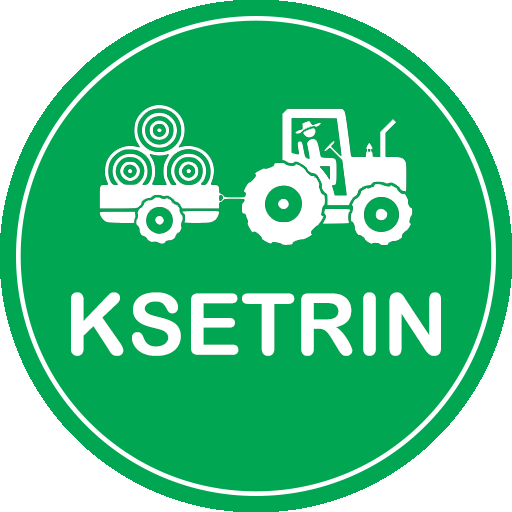
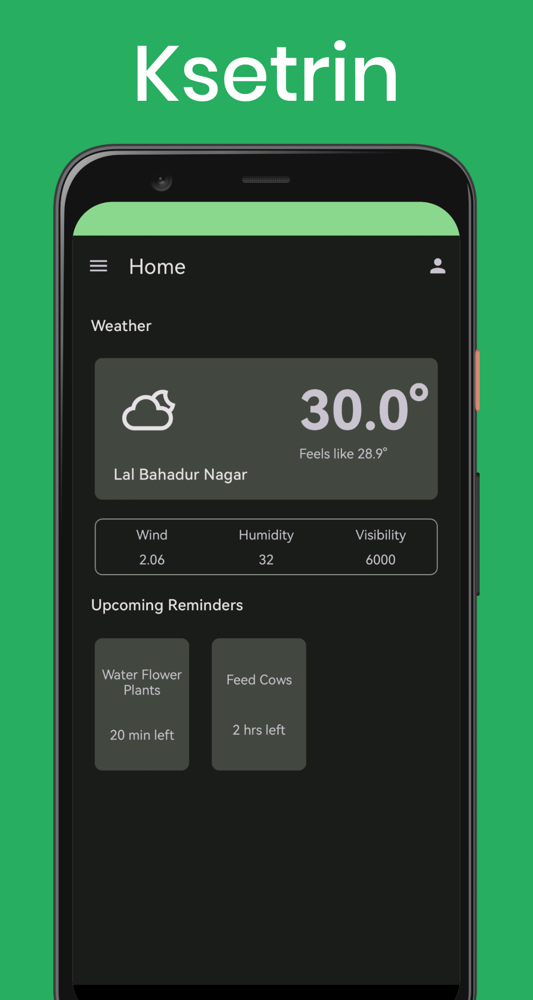
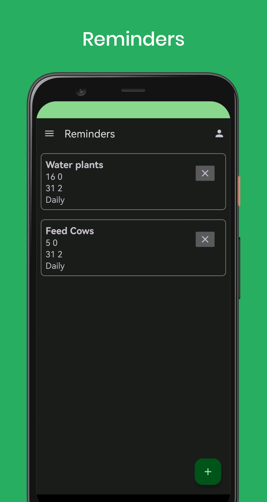
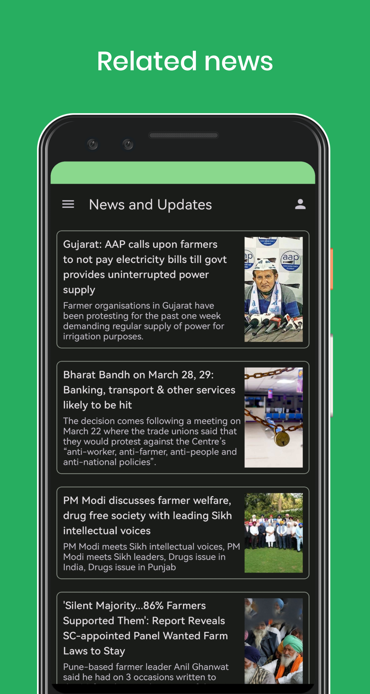
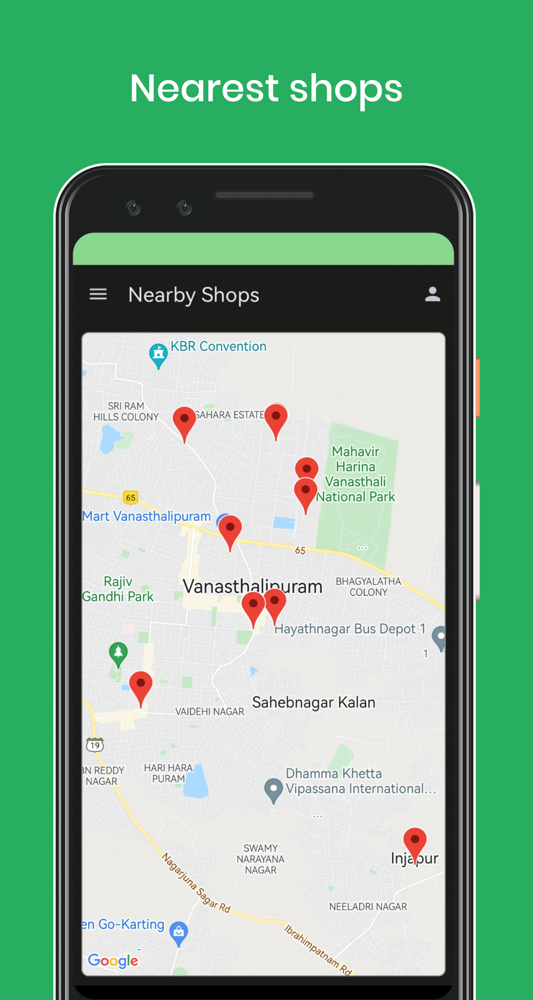
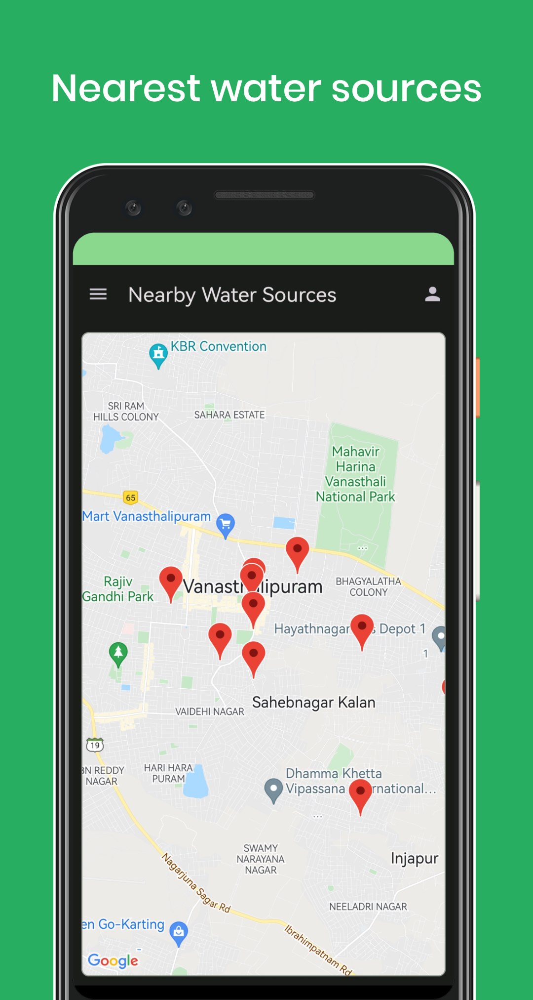

# KSETRIN

🌾 Kstetrin is an Android based app which primarily aims to help "farmers", who it literally translates to.

## Author
🌾 [@supersu-man](https://www.github.com/supersu-man)

## Tech Stack 
🌾 **Client:** Kotlin, XML

🌾 **Server:** Firebase

## Ksetrin currently provides
🌾 Weather Forecast

🌾 Agro related News

🌾 Location of nearest water bodies

🌾 Location of nearest Agro supplies stores

🌾 Reminders*

## Face of Ksetrin 
🌾 Here's how the app looks,

## Demo
🌾 The link below directs you to the video demonstrating how Ksetrin functions,

https://youtu.be/Sg9HVALvf9Y

## Our Team
🌾 [@supersu-man](https://www.github.com/supersu-man)

🌾 [@abhyaambati](https://www.github.com/abhyaambati)

🌾 [@vaishujyothi](https://www.github.com/vaishujyothi)

## Contributing
🌾 Pull requests are welcome. For major changes, please open an issue first to discuss what you would like to change.

